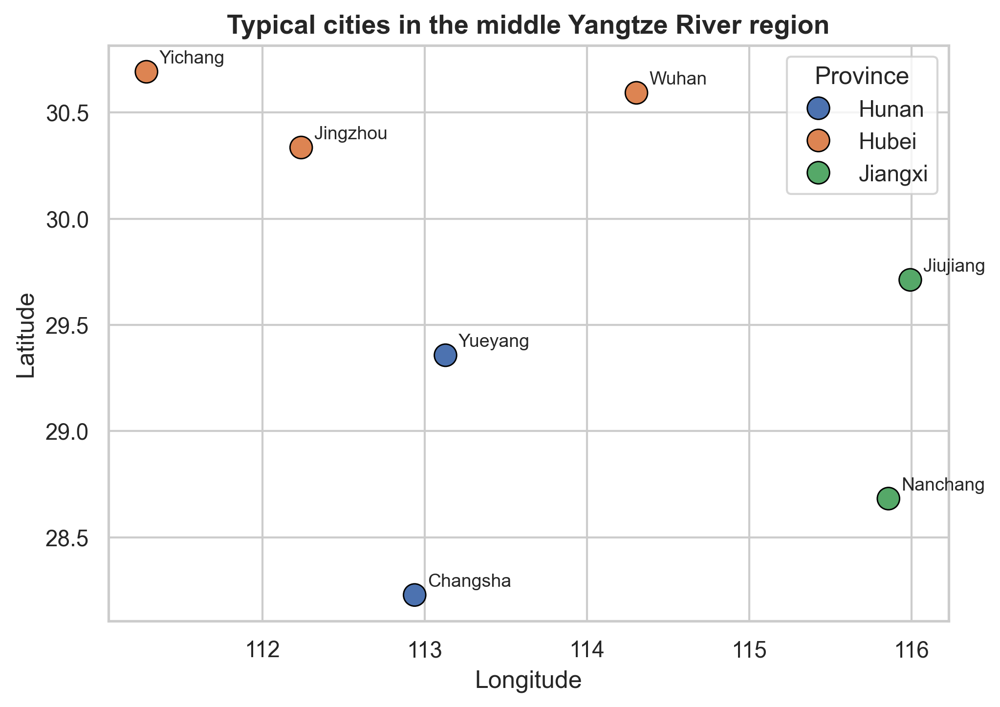
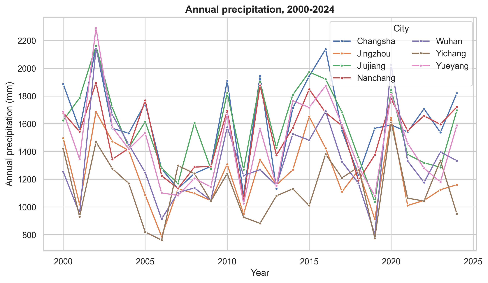
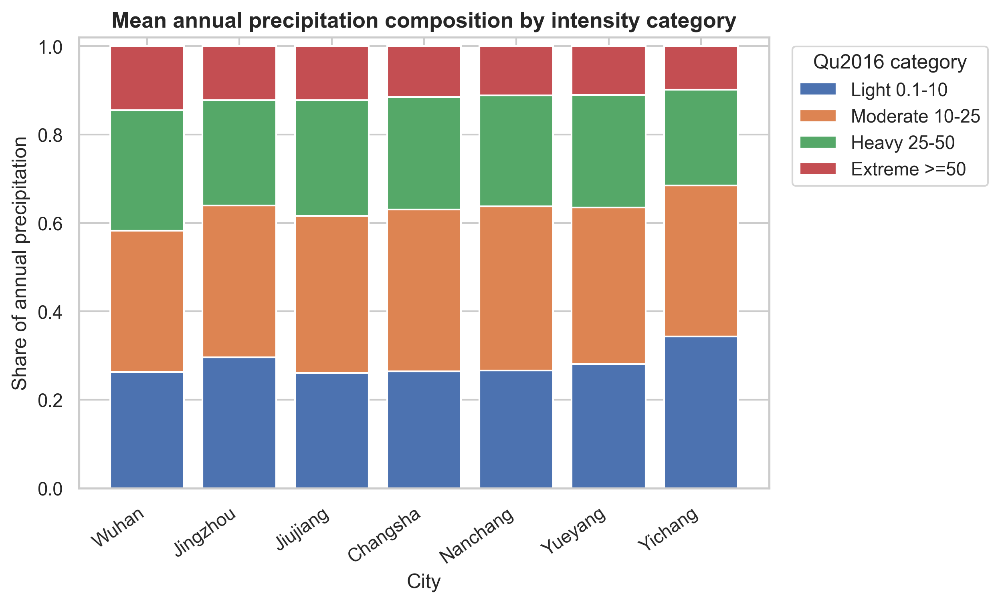
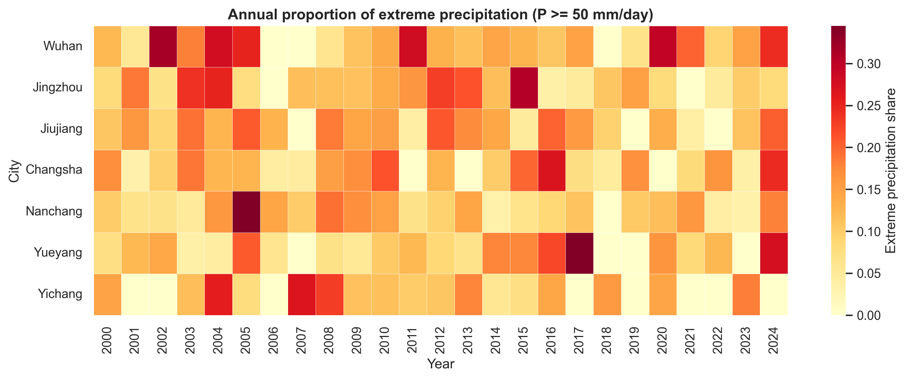
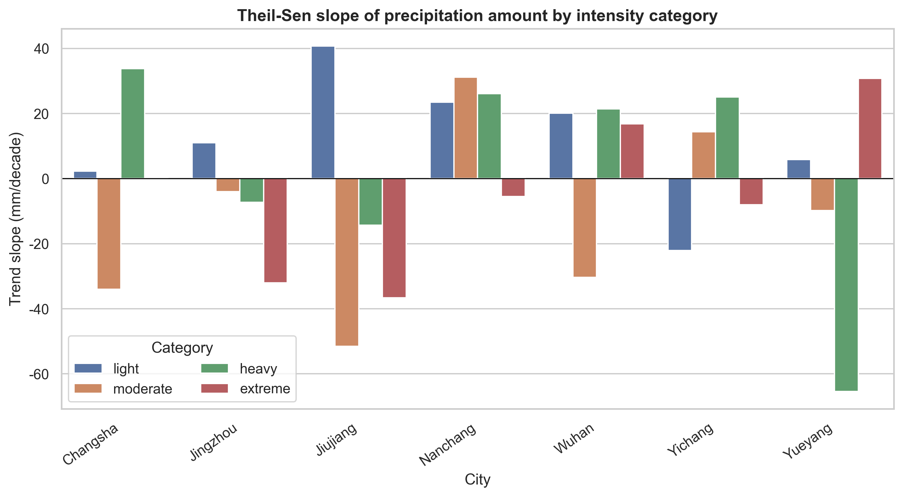
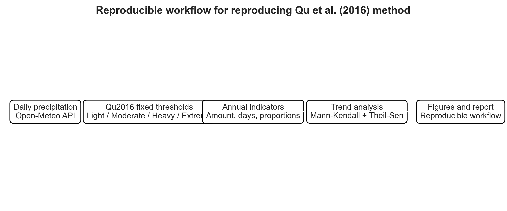

```{python}
#| label: setup
from pathlib import Path
import pandas as pd

ROOT = Path.cwd()
annual = pd.read_csv(ROOT / "data" / "processed" / "city_annual_precip_intensity_indices.csv")
summary = pd.read_csv(ROOT / "outputs" / "tables" / "city_summary_statistics.csv")
trend = pd.read_csv(ROOT / "outputs" / "tables" / "city_mk_theilsen_trends.csv")
composition = pd.read_csv(ROOT / "outputs" / "tables" / "city_intensity_composition.csv")
```

# 1. 研究背景

极端降水变化是气候变化、水文过程和水土保持研究中的重要问题。不同强度等级的降水对地表径流、坡面侵蚀、沟蚀和河岸稳定性的影响并不相同。因此，仅分析年降水总量并不能充分揭示降水结构变化对区域水文和侵蚀风险的潜在影响。

Qu et al. [-@qu2016daily] 基于中国气象站逐日降水数据，分析了中国十大流域 1960—2013 年不同强度等级降水量及其占比的变化，并使用 Mann-Kendall 检验和 Theil-Sen 斜率估计进行趋势分析。本文作为课程作业，复现其核心方法，并将该方法应用于长江中游典型城市。

# 2. 复现文章与复现范围

## 2.1 复现文章

本项目复现的文章为：

> Qu, B.; Lv, A.; Jia, S.; Zhu, W. (2016). Daily Precipitation Changes over Large River Basins in China, 1960–2013. *Water*, 8(5), 185.

原文的核心思想是：将逐日降水按照固定阈值划分为不同强度等级，分别统计各等级降水量和占总降水的比例，然后在年尺度和季节尺度上分析变化趋势。

## 2.2 本项目复现的内容

本项目复现以下方法：

1. 日降水固定阈值分级；
2. 各降水等级年度降水量、降水日数和降水占比统计；
3. Mann-Kendall 趋势显著性检验；
4. Theil-Sen 斜率估计，并换算为每 10 年变化量；
5. 可复现的数据下载、处理、分析和可视化流程。

## 2.3 与原文不同的地方

本项目不是对原文结果的完全复刻，而是对原文方法的课程化复现。主要差异包括：

- 原文使用中国气象站点数据，本项目使用 Open-Meteo Historical Weather API；
- 原文研究中国十大流域，本项目选择长江中游典型城市点位；
- 原文包含年尺度和季节尺度分析，本项目主要展示年尺度结果；
- 原文考虑了趋势预白化处理，本项目使用标准 Mann-Kendall 检验和 Theil-Sen 斜率估计。

# 3. 数据与方法

## 3.1 数据来源

本项目通过 Open-Meteo Historical Weather API 获取逐日降水数据，变量为 `precipitation_sum`，时间范围为 2000-01-01 至 2024-12-31。

```{python}
#| label: data-mode
metadata_path = ROOT / "data" / "raw" / "download_metadata.txt"
print(metadata_path.read_text(encoding="utf-8") if metadata_path.exists() else "Metadata file not found.")
```

## 3.2 研究城市

```{python}
#| label: city-table
city_table = annual[["city", "city_cn", "province", "lon", "lat"]].drop_duplicates()
city_table
```



## 3.3 日降水强度分级

参考 Qu et al. [-@qu2016daily]，本项目将逐日降水划分为四类：

| 等级 | 阈值 |
|---|---:|
| Light precipitation | 0.1 ≤ P < 10 mm/day |
| Moderate precipitation | 10 ≤ P < 25 mm/day |
| Heavy precipitation | 25 ≤ P < 50 mm/day |
| Extreme precipitation | P ≥ 50 mm/day |

说明：为避免无雨日被计入 light precipitation，本项目将 light precipitation 明确处理为 0.1 ≤ P < 10 mm/day。

## 3.4 年度指标

对每个城市和每一年，计算以下指标：

- 年降水总量；
- 湿日数；
- 各强度等级降水量；
- 各强度等级降水日数；
- 各强度等级降水量占全年降水量的比例；
- 年最大单日降水量。

## 3.5 趋势分析

对每个城市和每个指标，使用 Mann-Kendall 检验判断趋势显著性，使用 Theil-Sen 方法估计趋势斜率，并将斜率换算为每 10 年变化量。显著性标记如下：

| 标记 | 含义 |
|---|---|
| `***` | p < 0.001 |
| `**` | p < 0.01 |
| `*` | p < 0.05 |
| `+` | p < 0.1 |

# 4. 结果

## 4.1 年降水量变化



年降水量时间序列反映了不同城市在 2000—2024 年之间的降水年际波动。对于课程复现而言，这一图件主要用于展示数据处理和年度统计流程是否完整，而不直接等同于原文的流域尺度结论。

```{python}
#| label: summary-table
summary
```

## 4.2 不同强度等级降水贡献



该图复现了原文中“不同强度等级降水量及其占比”的核心分析思想。若某城市 extreme precipitation 占比较高，说明其年度降水中有较大部分来自强度较高的降水事件，这可能意味着更强的短时径流和侵蚀触发风险。

```{python}
#| label: composition-table
composition
```

## 4.3 极端降水占比的时空差异



热图显示各城市逐年 extreme precipitation 占比。颜色越深，说明该年该城市由 P ≥ 50 mm/day 降水贡献的比例越高。

## 4.4 Theil-Sen 斜率估计结果



图中展示不同强度等级降水量的 Theil-Sen 斜率，单位为 mm/decade。正值表示该强度等级降水量随时间增加，负值表示减少。是否显著应结合 Mann-Kendall 检验的 p 值判断。

```{python}
#| label: trend-selected-table
selected = trend[trend["metric"].isin(["annual_precip", "light_amount", "moderate_amount", "heavy_amount", "extreme_amount", "extreme_amount_ratio"])]
selected[["city_cn", "metric", "sen_slope_per_decade", "mk_p", "mk_trend", "significance"]]
```

## 4.5 可复现流程



# 5. 讨论

## 5.1 方法复现效果

本项目较好地复现了 Qu et al. [-@qu2016daily] 的固定阈值降水分级思想和趋势分析框架。通过脚本化流程，项目能够从逐日降水数据自动生成年度指标、趋势统计表和可视化图件，符合课程对可复现研究的要求。

## 5.2 与水土保持和河岸侵蚀研究的联系

从水土保持角度看，heavy precipitation 和 extreme precipitation 对坡面径流、沟蚀和河岸冲刷更敏感。若某城市 extreme precipitation 占比上升，即使年降水总量变化不明显，也可能意味着降水过程更集中，潜在的侵蚀触发风险增强。该思路可为后续结合 DEM、土地利用、土壤类型和河网数据开展水土流失风险分析提供前期降水指标基础。

## 5.3 局限性

本项目的主要局限性包括：

1. 城市点位数据不能代表完整流域尺度降水格局；
2. Open-Meteo 再分析/融合数据与原文气象站数据存在数据源差异；
3. 本项目未复现原文的站点质量控制、流域空间聚合和 TFPW 预白化流程；
4. 趋势结果受研究时段、数据源和点位选择影响，不应与原文流域结论直接比较。

# 6. 结论

本项目围绕 Qu et al. (2016) 的日降水分级与趋势分析方法，构建了一套可复现的数据分析流程。主要完成内容如下：

1. 获取并整理长江中游典型城市逐日降水数据；
2. 按固定阈值划分 light、moderate、heavy 和 extreme precipitation；
3. 计算各等级年度降水量、降水日数和降水占比；
4. 使用 Mann-Kendall 检验和 Theil-Sen 斜率估计进行趋势分析；
5. 输出结果表格、图件和 Quarto 报告。

# 7. 复现说明

在项目根目录运行：

```bash
python -m pip install -r requirements.txt
python scripts/00_run_all.py --force-download
quarto render report.qmd
```

无网络测试时可运行：

```bash
python scripts/00_run_all.py --demo
```

# References
